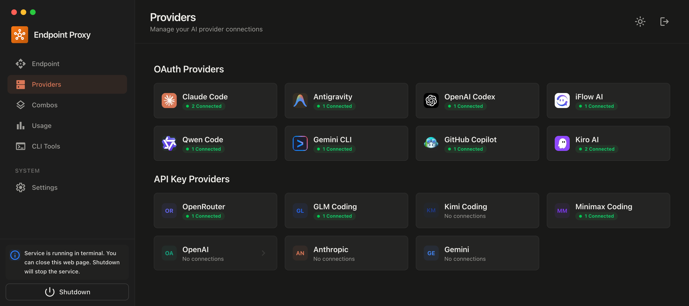

<div align="center">
  
  
  # 9Router - FREE AI Coding + Cheap Backups
  
  **Use Claude, Codex, Gemini for FREE • Ultra-cheap alternatives from $0.20/1M tokens**
  
  [](https://www.npmjs.com/package/9router)
  [](https://www.npmjs.com/package/9router)
  [](https://github.com/decolua/9router/blob/main/LICENSE)
  
  [🚀 Quick Start](#-quick-start) • [💰 Pricing](#-pricing-strategy) • [📖 Setup](#-setup-guide) • [🌐 Website](https://9router.com)
</div>

---

## Why 9Router?

Stop wasting your AI subscriptions and paying full price:

- ❌ **Subscription quota expires** unused every month
- ❌ **Rate limits** stop you mid-coding
- ❌ **Expensive APIs** ($20-50/month per provider)
- ❌ **Manual switching** between providers

**9Router maximizes value:**

- ✅ **Maximize Subscriptions** - Claude Code, Codex, Gemini, Copilot quota tracking
- ✅ **FREE Available** - iFlow, Qwen, Kiro when needed, via CLI
- ✅ **Ultra-Cheap Backup** - GLM ($0.6/1M), MiniMax M2.1 ($0.20/1M)
- ✅ **Smart Fallback** - Subscription → Cheap → Free, automatic switching

---

## ⚡ Quick Start

**Install globally:**

```bash
npm install -g 9router
9router
```

🎉 Dashboard opens → Connect Claude Code → Start coding!

**Use in Cursor/Cline:**

```
Endpoint: http://localhost:20128/v1
API Key: [from dashboard]
Model: cc/claude-opus-4-5-20251101
```

---

## 💰 Pricing Strategy

### 📅 MAXIMIZE SUBSCRIPTIONS (Primary)

Already paying? Get full value with quota tracking:

| Provider | What You Get | Quota Reset | Monthly Cost |
|----------|--------------|-------------|--------------|
| **Claude Code** (Pro/Max) | Claude 4.5 Opus/Sonnet/Haiku | 5-hour + Weekly | $20-100 |
| **OpenAI Codex** (Plus/Pro) | GPT 5.2 Codex, GPT 5.1 Codex Max | 5-hour + Weekly | $20-200 |
| **Gemini CLI** (FREE tier!) | 180K completions/month, 1K/day | Daily/Monthly | **$0** |
| **GitHub Copilot** | GPT-5, Claude 4.5, Gemini 3 | Monthly (1st) | $10-19 |
| **Antigravity** (Google) | Gemini 3 Pro, Claude Sonnet 4.5 | Similar to Gemini | **$0** |

**Value:** Use every bit of your subscription quota before it resets!

### 💰 ULTRA CHEAP (Backup)

When subscription quota runs out, pay pennies:

| Provider | Pricing (per 1M tokens) | Quota Reset | Cost for 10M |
|----------|------------------------|-------------|--------------|
| **GLM-4.7** | $0.60 input / $2.20 output | Daily 10:00 AM | ~$6-22 |
| **MiniMax M2.1** | $0.20 input / $1.00 output | 5-hour rolling | ~$2-10 |
| **Kimi K2** | $9/month (10M tokens) | Monthly | **$9 flat** |

**Value:** ~90% cheaper than ChatGPT API ($20/1M)!

### 🆓 FREE FOREVER (Fallback)

No API key needed, unlimited:

| Provider | Top Models | Notes |
|----------|-----------|-------|
| **iFlow** | Kimi K2, Qwen3 Coder Plus, GLM 4.7, MiniMax M2 | 8 models via OAuth |
| **Qwen** | Qwen3 Coder Plus/Flash, Vision | 3 models via OAuth |
| **Kiro** | Claude Sonnet 4.5, Haiku 4.5 | AWS Builder ID |

**Value:** Emergency backup when everything else is quota-limited!

---

## ✨ Key Features

### 🔄 Smart 3-Tier Fallback

```
Setup once, never stop coding:

Tier 1 (SUBSCRIPTION): Claude Code → Codex → Gemini
  ↓ quota exhausted
Tier 2 (CHEAP): GLM-4.7 → MiniMax M2.1 → Kimi
  ↓ budget limit
Tier 3 (FREE): iFlow → Qwen → Kiro

→ Automatic switching, zero downtime!
```

### 📊 Quota Tracking

- Real-time token consumption
- Reset countdown per provider
- Cost estimation (paid tiers)
- Monthly spending reports

### 🎯 Universal CLI Support

✅ **Cursor** • **Cline** • **Claude Desktop** • **Codex** • **RooCode** • **Continue** • **Any tool with custom OpenAI endpoint**

### 🌐 Deploy Options

💻 **Localhost** • ☁️ **VPS/Cloud** • 🐳 **Docker** • 🚀 **Cloudflare Workers**

---

## 📖 Setup Guide

<details>
<summary><b>Subscription Providers (Maximize Value)</b></summary>

### Claude Code (Pro/Max)

```bash
Dashboard → Providers → Connect Claude Code
→ OAuth login → Auto token refresh
→ 5-hour + weekly quota tracking

Use: cc/claude-opus-4-5-20251101
     cc/claude-sonnet-4-5-20250929
```

**Pro Tip:** Use Opus for complex tasks, Sonnet for speed. 9Router tracks quota per model!

### OpenAI Codex (Plus/Pro)

```bash
Dashboard → Providers → Connect Codex
→ OAuth login (port 1455)
→ 5-hour + weekly reset

Use: cx/gpt-5.2-codex
     cx/gpt-5.1-codex-max
```

### Gemini CLI (FREE 180K/month!)

```bash
Dashboard → Providers → Connect Gemini CLI
→ Google OAuth
→ 180K completions/month + 1K/day

Use: gc/gemini-3-flash-preview
     gc/gemini-2.5-pro
```

**Best Value:** Huge free tier! Use this before paid tiers.

### GitHub Copilot

```bash
Dashboard → Providers → Connect GitHub
→ OAuth via GitHub
→ Monthly reset (1st of month)

Use: gh/gpt-5
     gh/claude-4.5-sonnet
```

</details>

<details>
<summary><b>Cheap Providers (Backup)</b></summary>

### GLM-4.7 (Daily reset, $0.6/1M)

1. Sign up: [Zhipu AI](https://open.bigmodel.cn/)
2. Get API key from Coding Plan
3. Dashboard → Add API Key:
   - Provider: `glm`
   - API Key: `your-key`

**Use:** `glm/glm-4.7`

**Pro Tip:** Coding Plan offers 3× quota at 1/7 cost! Reset daily 10:00 AM.

### MiniMax M2.1 (5h reset, $0.20/1M)

1. Sign up: [MiniMax](https://www.minimax.io/)
2. Get API key
3. Dashboard → Add API Key:
   - Provider: `minimax`
   - API Key: `your-key`

**Use:** `minimax/MiniMax-M2.1`

**Pro Tip:** 5-hour rolling window. Cheapest option for long context (1M tokens)!

### Kimi K2 ($9/month flat)

1. Subscribe: [Moonshot AI](https://platform.moonshot.ai/)
2. Get API key
3. Dashboard → Add API Key:
   - Provider: `kimi`
   - API Key: `your-key`

**Use:** `kimi/kimi-latest`

**Pro Tip:** Fixed $9/month for 10M tokens = $0.90/1M effective cost!

</details>

<details>
<summary><b>FREE Providers (Emergency Backup)</b></summary>

### iFlow (8 FREE models)

```bash
Dashboard → Connect iFlow
→ iFlow OAuth login
→ Unlimited usage

Use: if/kimi-k2-thinking
     if/qwen3-coder-plus
     if/glm-4.7
     if/minimax-m2
```

### Qwen (3 FREE models)

```bash
Dashboard → Connect Qwen
→ Device code authorization
→ Unlimited usage

Use: qw/qwen3-coder-plus
     qw/qwen3-coder-flash
```

### Kiro (Claude FREE)

```bash
Dashboard → Connect Kiro
→ AWS Builder ID or Google/GitHub
→ Unlimited usage

Use: kr/claude-sonnet-4.5
     kr/claude-haiku-4.5
```

</details>

<details>
<summary><b>Combo Examples</b></summary>

### Example 1: Maximize Subscription → Cheap Backup

```
Dashboard → Combos → Create New

Name: premium-coding
Models:
  1. cc/claude-opus-4-5-20251101 (Subscription primary)
  2. glm/glm-4.7 (Cheap backup, $0.6/1M)
  3. minimax/MiniMax-M2.1 (Cheapest fallback, $0.20/1M)

Use in CLI: premium-coding

Monthly cost example (100M tokens):
  80M via Claude (subscription): $0 extra
  15M via GLM: $9
  5M via MiniMax: $1
  Total: $10 + your subscription
```

### Example 2: Budget-First with Free Fallback

```
Name: budget-combo
Models:
  1. glm/glm-4.7 (Daily quota, cheap)
  2. minimax/MiniMax-M2.1 (5h quota, cheapest)
  3. if/kimi-k2-thinking (FREE unlimited)

Monthly cost (100M tokens):
  70M via GLM: $42
  20M via MiniMax: $4
  10M via iFlow: $0
  Total: ~$46 vs $2000 on ChatGPT API!
```

### Example 3: Free-Only (Zero Cost)

```
Name: free-combo
Models:
  1. if/kimi-k2-thinking
  2. qw/qwen3-coder-plus
  3. kr/claude-sonnet-4.5

Cost: $0 forever!
```

</details>

<details>
<summary><b>CLI Integration</b></summary>

### Cursor IDE

```
Settings → Models → Advanced:
  OpenAI API Base URL: http://localhost:20128/v1
  OpenAI API Key: [from 9router dashboard]
  Model: cc/claude-opus-4-5-20251101
```

Or use combo: `premium-coding`

### Claude Desktop (Claude Code)

Edit `~/.claude/config.json`:

```json
{
  "anthropic_api_base": "http://localhost:20128/v1",
  "anthropic_api_key": "your-9router-api-key"
}
```

**Models:** `cc/claude-opus-4-5`, `glm/glm-4.7`, or combo name

### Codex CLI

```bash
export OPENAI_BASE_URL="http://localhost:20128"
export OPENAI_API_KEY="your-9router-api-key"

codex "your prompt"
```

**Models:** `cx/gpt-5.2-codex`, `glm/glm-4.7`, or combo

### Cline / Continue / RooCode

```
Provider: OpenAI Compatible
Base URL: http://localhost:20128/v1
API Key: [from dashboard]
Model: cc/claude-opus-4-5-20251101
```

</details>

<details>
<summary><b>Deployment</b></summary>

### VPS Deployment

```bash
# Clone and install
git clone https://github.com/decolua/9router.git
cd 9router/app
npm install
npm run build

# Configure
export JWT_SECRET="your-secure-secret-change-this"
export INITIAL_PASSWORD="your-password"
export DATA_DIR="/var/lib/9router"
export NODE_ENV="production"

# Start
npm run start

# Or use PM2
npm install -g pm2
pm2 start npm --name 9router -- start
pm2 save
pm2 startup
```

### Docker

```bash
docker build -t 9router .
docker run -d \
  -p 3000:3000 \
  -e JWT_SECRET="your-secure-secret" \
  -e INITIAL_PASSWORD="your-password" \
  -v 9router-data:/app/data \
  9router
```

### Environment Variables

| Variable | Default | Description |
|----------|---------|-------------|
| `JWT_SECRET` | Auto-generated | **MUST change in production!** |
| `DATA_DIR` | `~/.9router` | Database storage path |
| `INITIAL_PASSWORD` | `123456` | Dashboard login password |
| `NODE_ENV` | `development` | Set to `production` for deploy |
| `ENABLE_REQUEST_LOGS` | `false` | Debug request/response logs |

### Reverse Proxy (Nginx)

```nginx
server {
    listen 80;
    server_name your-domain.com;

    location / {
        proxy_pass http://localhost:3000;
        proxy_http_version 1.1;
        proxy_set_header Upgrade $http_upgrade;
        proxy_set_header Connection 'upgrade';
        proxy_set_header Host $host;
        
        # SSE support
        proxy_buffering off;
        proxy_read_timeout 86400;
    }
}
```

</details>

---

## 💡 Cost Optimization Tips

### Monthly Budget: $10-20/month

```
Strategy:
1. Use Gemini CLI free tier (180K/month) for quick tasks
2. Use Claude Code subscription quota fully (you already pay)
3. Fallback to GLM ($0.6/1M) when quota out
4. Emergency: MiniMax M2.1 ($0.20/1M) or iFlow (free)

Real example (100M tokens/month):
  60M via Gemini CLI: $0 (free tier)
  30M via Claude Code: $0 (subscription you already have)
  8M via GLM: $4.80
  2M via MiniMax: $0.40
  Total: $5.20/month + existing subscriptions
```

### Quota Reset Strategy

```
Daily routine:
1. Morning: Fresh Claude Code quota (5h reset)
2. Afternoon: Switch to Gemini CLI (1K/day)
3. Evening: GLM daily quota (reset 10AM next day)
4. Late night: MiniMax (5h rolling) or iFlow (free)

→ Code 24/7 with minimal extra cost!
```

### Model Selection Guide

| Task | Best Model | Cost | Why |
|------|-----------|------|-----|
| Complex reasoning | `cc/claude-opus-4-5` | Subscription | Best quality |
| Fast coding | `cx/gpt-5.2-codex` | Subscription | Fastest Codex |
| Budget coding | `glm/glm-4.7` | $0.6/1M | Daily quota |
| Long context | `minimax/MiniMax-M2.1` | $0.20/1M | 1M context cheap |
| Emergency backup | `if/kimi-k2-thinking` | FREE | Unlimited |

---

## 📊 Available Models

<details>
<summary><b>Subscription Models (Maximize First)</b></summary>

**Claude Code (`cc/`)** - Pro/Max:
- `cc/claude-opus-4-5-20251101` - Claude 4.5 Opus
- `cc/claude-sonnet-4-5-20250929` - Claude 4.5 Sonnet
- `cc/claude-haiku-4-5-20251001` - Claude 4.5 Haiku

**Codex (`cx/`)** - Plus/Pro:
- `cx/gpt-5.2-codex` - GPT 5.2 Codex
- `cx/gpt-5.2` - GPT 5.2
- `cx/gpt-5.1-codex-max` - GPT 5.1 Codex Max
- `cx/gpt-5.1-codex` - GPT 5.1 Codex

**Gemini CLI (`gc/`)** - FREE 180K/month:
- `gc/gemini-3-flash-preview` - Gemini 3 Flash Preview
- `gc/gemini-3-pro-preview` - Gemini 3 Pro Preview
- `gc/gemini-2.5-pro` - Gemini 2.5 Pro
- `gc/gemini-2.5-flash` - Gemini 2.5 Flash

**GitHub Copilot (`gh/`)** - Subscription:
- `gh/gpt-5` - GPT-5
- `gh/gpt-5.1-codex-max` - GPT-5.1 Codex Max
- `gh/claude-4.5-sonnet` - Claude 4.5 Sonnet
- `gh/gemini-3-pro` - Gemini 3 Pro

**Antigravity (`ag/`)** - Google account:
- `ag/gemini-3-pro-high` - Gemini 3 Pro High
- `ag/claude-sonnet-4-5` - Claude Sonnet 4.5
- `ag/claude-opus-4-5-thinking` - Claude Opus 4.5

</details>

<details>
<summary><b>Cheap Models (Backup)</b></summary>

**GLM (`glm/`)** - $0.6/$2.2 per 1M:
- `glm/glm-4.7` - GLM 4.7 (daily reset 10AM)
- `glm/glm-4.6v` - GLM 4.6V Vision

**MiniMax (`minimax/`)** - $0.20/$1.00 per 1M:
- `minimax/MiniMax-M2.1` - MiniMax M2.1 (5h reset)

**Kimi (`kimi/`)** - $9/month (10M tokens):
- `kimi/kimi-latest` - Kimi Latest

**OpenRouter (`openrouter/`)** - Passthrough pricing:
- `openrouter/auto` - Auto (Best Available)
- Any OpenRouter model ID supported

</details>

<details>
<summary><b>FREE Models (Emergency)</b></summary>

**iFlow (`if/`)** - 8 models FREE:
- `if/kimi-k2-thinking` - Kimi K2 Thinking
- `if/kimi-k2` - Kimi K2
- `if/qwen3-coder-plus` - Qwen3 Coder Plus
- `if/glm-4.7` - GLM 4.7
- `if/minimax-m2` - MiniMax M2
- `if/deepseek-r1` - DeepSeek R1
- `if/deepseek-v3.2-chat` - DeepSeek V3.2 Chat
- `if/deepseek-v3.2-reasoner` - DeepSeek V3.2 Reasoner

**Qwen (`qw/`)** - 3 models FREE:
- `qw/qwen3-coder-plus` - Qwen3 Coder Plus
- `qw/qwen3-coder-flash` - Qwen3 Coder Flash
- `qw/vision-model` - Qwen3 Vision

**Kiro (`kr/`)** - 2 models FREE:
- `kr/claude-sonnet-4.5` - Claude Sonnet 4.5
- `kr/claude-haiku-4.5` - Claude Haiku 4.5

</details>

---

## 🐛 Troubleshooting

**"Language model did not provide messages"**
- Provider quota exhausted → Check dashboard quota tracker
- Solution: Use combo fallback or switch to cheaper tier

**Rate limiting**
- Subscription quota out → Fallback to GLM/MiniMax
- Add combo: `cc/claude-opus → glm/glm-4.7 → minimax/MiniMax-M2.1`

**OAuth token expired**
- Auto-refreshed by 9Router
- If issues persist: Dashboard → Provider → Reconnect

**High costs**
- Check usage stats in Dashboard
- Switch primary model to GLM/MiniMax
- Use free tier (Gemini CLI, iFlow) for non-critical tasks

---

## 🛠️ Tech Stack

- **Runtime**: Node.js 20+
- **Framework**: Next.js 15
- **UI**: React 19 + Tailwind CSS 4
- **Database**: LowDB (JSON file-based)
- **Streaming**: Server-Sent Events (SSE)
- **Auth**: OAuth 2.0 (PKCE) + JWT + API Keys

---

## 📝 API Reference

### Chat Completions

```bash
POST http://localhost:20128/v1/chat/completions
Authorization: Bearer your-api-key
Content-Type: application/json

{
  "model": "cc/claude-opus-4-5-20251101",
  "messages": [
    {"role": "user", "content": "Write a function to..."}
  ],
  "stream": true
}
```

### List Models

```bash
GET http://localhost:20128/v1/models
Authorization: Bearer your-api-key

→ Returns all models + combos in OpenAI format
```

### Responses API (Codex)

```bash
POST http://localhost:20128/v1/responses
POST http://localhost:20128/codex/responses
```

---

## 🤝 Contributing

1. Fork → Branch → Commit → Push → PR
2. See [CONTRIBUTING.md](CONTRIBUTING.md)

---

## 📧 Support

- **Website**: [9router.com](https://9router.com)
- **GitHub**: [github.com/decolua/9router](https://github.com/decolua/9router)
- **Issues**: [github.com/decolua/9router/issues](https://github.com/decolua/9router/issues)

---

## 🙏 Acknowledgments

Special thanks to **CLIProxyAPI** - the original Go implementation that inspired this JavaScript port.

---

## 📄 License

MIT License - see [LICENSE](LICENSE) for details.

---

<div align="center">
  <sub>Built with ❤️ for developers maximizing AI value</sub>
</div>
